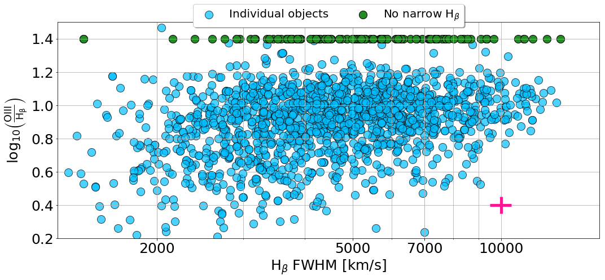

# Broad and narrow line decomposition for 1561 type I AGN

See
```
The Intrinsic Scatter of the Broad Lines–Narrow Line Correlation in Type I AGN
```
https://iopscience.iop.org/article/10.3847/1538-3881/ab737c


